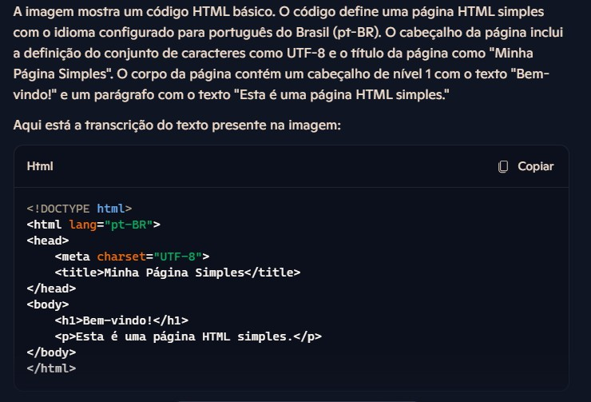
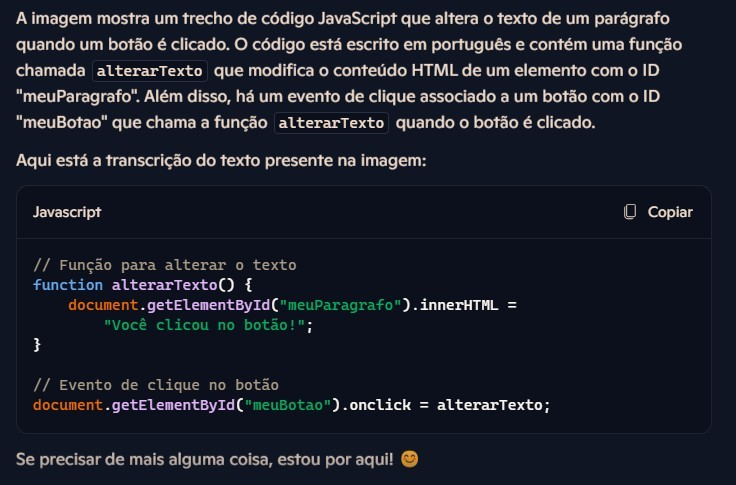
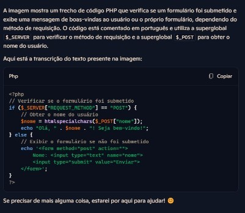
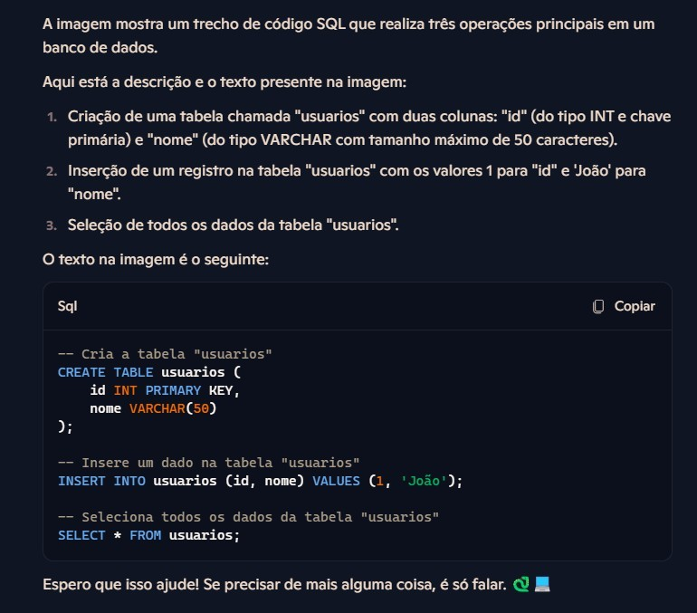

# Projeto de Reconhecimento de Imagem - DIO

Este repositório contém o projeto prático para o bootcamp [Microsoft Copilot AI](https://web.dio.me/track/microsoft-copilot-ai) da DIO, onde utilizei o Microsoft Copilot para reconhecimento e transcrição de códigos a partir de imagens. 
As linguagens abordadas foram HTML, JavaScript, PHP, Python e SQL, e cada resposta gerada foi documentada em um arquivo Word, além de um arquivo individual com cada código transcrito em suas respectivas linguagens, organizados neste repositório.

## Estrutura do Repositório

- **inputs**: Pasta onde estão salvas as imagens originais utilizadas no projeto.
- **outputs**: Pasta onde estão armazenados os resultados de reconhecimento de texto.
- **Final_Challlenge_Answers_Copilot.docx**: Documento que compila as transcrições e descrições dos códigos gerados pelo Copilot.
- **answer_html.html**: arquivo que contém o código gerado da imagem code_html.jpg
- **answer_javascript.js**: arquivo que contém o código gerado da imagem code_javascript
- **answer_php.php**: arquivo que contém o código gerado da imagem code_php.jpg
- **answer_python.py**: arquivo que contém o código gerado da imagem code_python.jpg
- **answer_sql.sql**: arquivo que contém o código gerado da imagem code_sql.jpg
- **README.md**: Este arquivo, que descreve o processo de criação do projeto.

## Prints do Processo

Abaixo estão alguns prints das respostas fornecidas pelo Microsoft Copilot para as imagens de código:

### HTML

### JavaScript

### PHP

### Python

### SQL

## Descrição do Processo

1. **Extração de Texto das Imagens**: Cada imagem contendo códigos em diferentes linguagens foi analisada pelo Microsoft Copilot, que gerou descrições e transcrições do código presente.
2. **Organização e Compilação**: As respostas foram organizadas em um documento Word, facilitando a apresentação e documentação dos resultados.
3. **Estruturação do Repositório**: O repositório foi organizado em pastas para manter os arquivos originais e os resultados de maneira organizada.

## Insights e Aprendizados

Durante o processo, foi possível observar algumas funcionalidades úteis do Microsoft Copilot para transcrição de código:
- **Reconhecimento Preciso de Sintaxe**: O Copilot conseguiu identificar corretamente os elementos sintáticos de cada linguagem, tornando a transcrição fiel ao código original.
- **Versatilidade em Diferentes Linguagens**: A ferramenta demonstrou habilidade em interpretar e descrever códigos de várias linguagens, o que facilita a documentação de projetos diversos.

## Possibilidades de Aprimoramento

Este projeto abre diversas possibilidades para aprimoramentos futuros, como:
- **Automatização Completa do Processo**: Integrar o Copilot com scripts para automatizar a extração e compilação de código em documentos.
- **Expansão para Outras Linguagens**: Testar a eficácia do Copilot em outras linguagens de programação e contextos mais complexos.
- **Análise Comparativa com Outras Ferramentas**: Realizar uma comparação entre o Copilot e outras ferramentas de reconhecimento de código para avaliar sua eficiência.

Este projeto contribuiu para o aprimoramento do meu portfólio, oferecendo um registro documentado de habilidades técnicas em várias linguagens.
